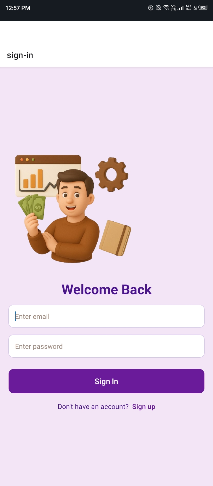
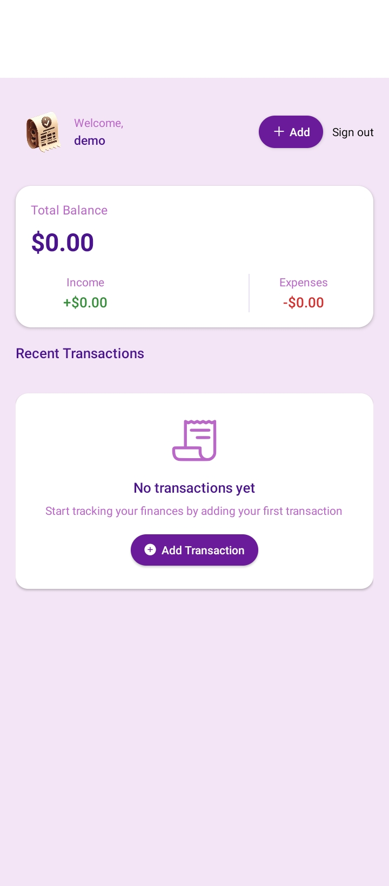
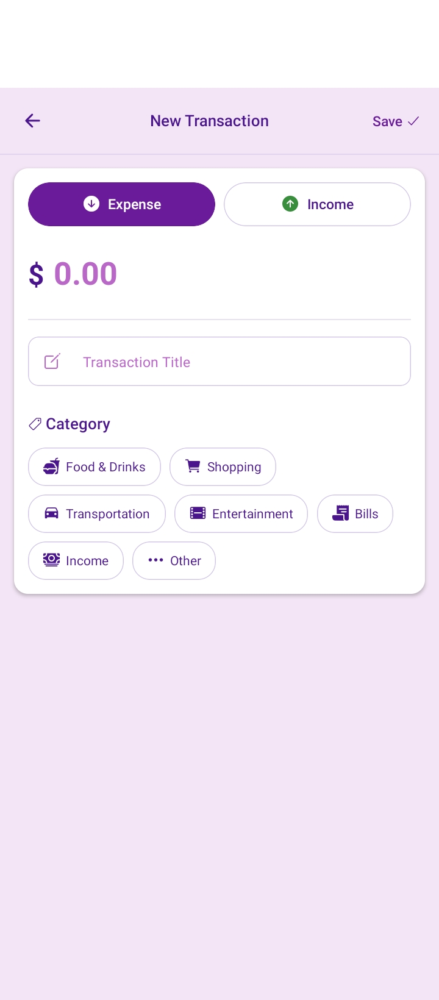
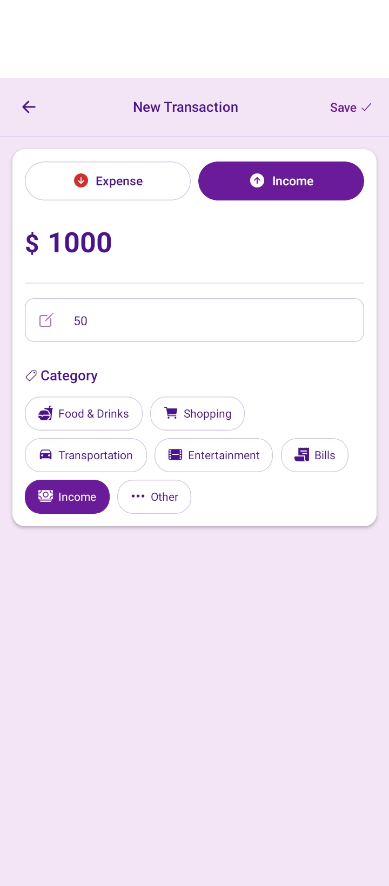
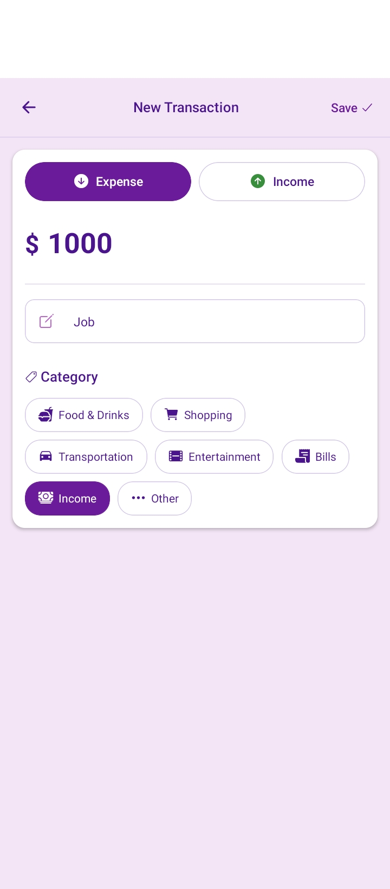

<div align="center">

# 💰 Expense-Tracker


</div>

# 💰 ExpenseFlow — Personal & Shared Expense Tracker

**A modern full-stack mobile expense tracking app — track spending, visualize finances, and manage money on the go.**


---
<div align="center">

# 💰 ExpenseFlow


</div>


## 🚀 Project Overview

**ExpenseFlow** is a cross-platform mobile expense tracker built with **React Native (Expo)** and a **Node.js + Express** backend. It lets users log income and expenses, categorize spending, and view real-time financial summaries — all from a clean, mobile-first UI.

The app handles the full money-management flow: secure sign-in, adding transactions with categories, live balance tracking, and transaction history — backed by a **serverless PostgreSQL database (NeonDB)** and protected with **rate limiting via Upstash Redis**.

**What users can do:**

- 🔐 Sign up & sign in securely
- 💵 Add income & expense transactions
- 🏷️ Categorize spending (Food, Shopping, Bills, Transport…)
- 📊 View live balance, income, and expense summary
- 🗑️ Delete transactions
- 📱 Works on Android & iOS

## 📸 Screenshots

| Sign In | Home — Balance & Summary | Add Expense |
| :---: | :---: | :---: |
|  |  |  |

| Income | Expense Purpose | Rejister|
| :---: | :---: | :---: |
|  |  |  |


## 🛠 Tech Stack & Engineering Skills Applied

### Mobile & Frontend Engineering


- **Framework:** React Native with Expo (SDK 54)
- **Navigation:** Expo Router (file-based routing)
- **State & Data:** Custom React hooks (`useTransactions`)
- **UI:** Custom reusable components (`BalanceCard`, `TransactionItem`, `PageLoader`)
- **Storage:** AsyncStorage for local session
- **Icons:** `@expo/vector-icons` (Ionicons)
- **Charts:** (planned) `react-native-chart-kit`

### Backend, Services & Integrations


- **Backend:** Node.js + Express.js REST API
- **Database:** Serverless PostgreSQL via **NeonDB** (`@neondatabase/serverless`)
- **Rate Limiting:** **Upstash Redis** + `@upstash/ratelimit`
- **Scheduled Tasks:** `cron` job to keep the server awake (free-tier hosts)
- **Security:** Middleware-based rate limiting, environment-based config
- **Auth (planned):** Clerk (`@clerk/clerk-expo`) — for production builds

---

## 📁 Project Structure

```text
Expense-Tracker-App-/
├── backend/                      # Node.js + Express REST API
│   ├── src/
│   │   ├── config/               # DB, cron, Upstash configs
│   │   ├── controllers/          # Route logic
│   │   ├── middleware/           # Rate limiter, security
│   │   ├── routes/               # API route definitions
│   │   └── server.js             # Entry point
│   └── package.json
│
├── mobile/                       # React Native (Expo) app
│   ├── app/                      # Expo Router screens
│   │   ├── (auth)/               # sign-in, sign-up
│   │   └── (root)/               # home, create
│   ├── components/               # Reusable UI components
│   ├── hooks/                    # Custom React hooks
│   ├── lib/                      # Utilities (fakeAuth, etc.)
│   ├── constants/                # API URL, colors
│   ├── assets/                   # Images, styles
│   └── package.json
│
└── README.md
```

---

## 🚀 Quick Start & Installation

### Prerequisites

- **Node.js** (v16+)
- **npm**
- **Expo Go** app on your Android/iOS device
- **NeonDB** account (free) → https://neon.tech
- **Upstash** account (free) → https://upstash.com

### 1. Clone the Repository

```bash
git clone https://github.com/waleedkhokar/expenseflow.git
cd Expense Tracker
```

### 2. Backend Setup

```bash
cd backend
npm install
```

Create a `.env` file in `backend/`:

```env
PORT=3000
NODE_ENV=development
DATABASE_URL=your_neondb_connection_string
UPSTASH_REDIS_REST_URL=your_upstash_url
UPSTASH_REDIS_REST_TOKEN=your_upstash_token
API_URL=http://localhost:3000/api/health
```

Start the backend:

```bash
npm run dev
```

### 3. Mobile App Setup

```bash
cd ../mobile
npm install
npx expo start
```

Scan the QR code with **Expo Go** on your phone.

> ⚠️ **Important:** Update `mobile/constants/api.js` with your Mac/PC's LAN IP:
> ```js
> export const API_URL = "http://YOUR_LOCAL_IP:3000/api";
> ```

## 🎯 Roadmap

- [x] REST API with transactions
- [x] Rate limiting with Upstash
- [x] Mobile UI with Expo Router
- [x] Balance & summary card
- [ ] Clerk authentication (production)
- [ ] 📊 Charts & spending analytics
- [ ] 👥 Shared expenses
- [ ] 📅 Monthly budgets
- [ ] 🔔 Budget alerts
- [ ] 🌙 Dark / Light mode
- [ ] 💵 PKR currency support


## 👨‍💻 Developer

**Waleed Khokhar**

***Full-Stack AI Engineer***

Full-Stack Developer with 1+ year of experience building scalable **web applications** and **mobile apps (Android & iOS)** with AI-powered features. Specializing in intelligent AI solutions using **Generative AI, LLMs, Agentic AI, RAG, and LangChain automation**, alongside proficiency in **Next.js, MERN stack, and Python/FastAPI backends**.

## 🌐 Connect With Me

<div align="center">

[](https://waledkhokar.vercel.app/)
[](https://linkedin.com/in/waleedkhokhar)
[](https://github.com/waleedkhokar)

</div>

---

## 📄 License

Currently a personal/private portfolio and development project.

---

⭐ **If you liked this project, drop a ⭐ on the repo and share it with others!**
